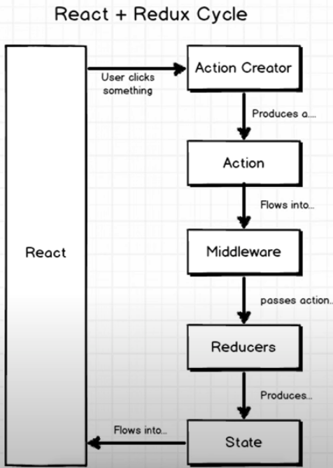
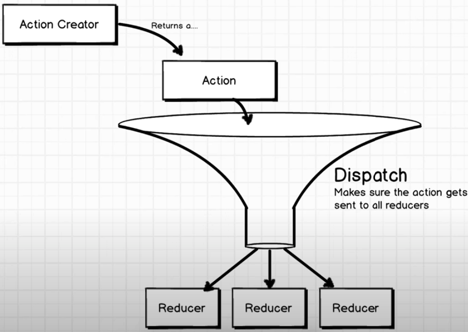
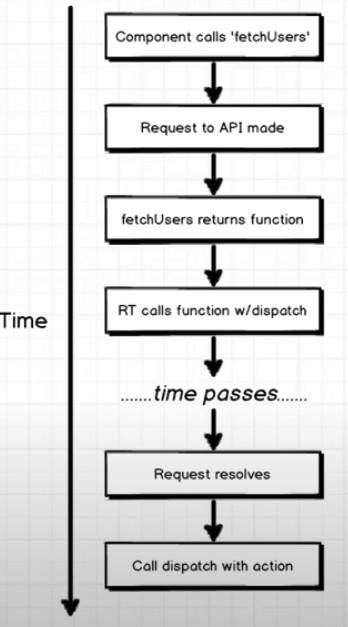

## The vanilla redux






By default, Redux action creators don’t support asynchronous actions like fetching data.
```
    export funciton fetchData()
    {
        const request = axio.get('http://...')

        // vanilla redux expect return an action with the data as the paylod there
        // The action is a plain javascript object
        return {
            type: 'FETCH_DATA',
            items
        };
    }
```
Obviously, it would be a lot harder in this scenario to know if the items are still loading or checking if we have an error.

## Thunk
Redux Thunk give us direct control over the displach method.

Thunk allows the action creators returns **a function instead of an object**. 

The first argument of the funciton is **dispatch**
```
    export funciton fetchData()
    {
        const request = axio.get('http://...')

        return (dispach) => {
            dispatch(LOADING...);

            request.then(({data})=>{
                dispath({type:'FETCH_DATA', payload: data})
            })
            .catch(() => dispatch(ERROR...));
        }
    }
```


